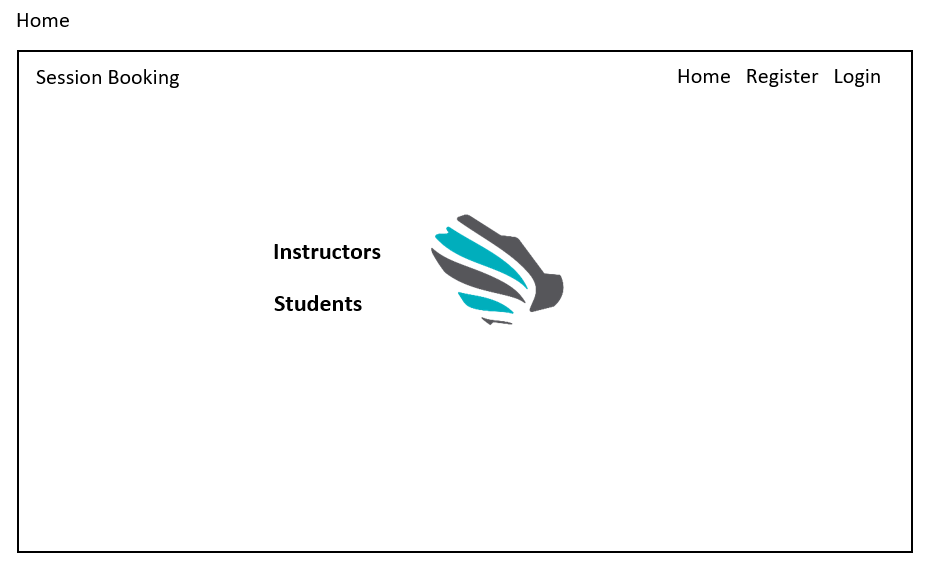

<div>
  

  


----

# Tuwaiq Session Booking
### المقدمــة | Introduction 
 
 هذا التطبيق يهدف إلى تسهيل عملية حجز جلسات التدريب الأحادية (أي جلسات التدريب خارج نطاق الدوام الرسمي في معسكر طويق والتي تتم بناء على رغبة الطالب واحتياجه). 
 

<div dir="ltr"  >

### Demo  
 

### Demo  
 
### Wireframe 
Home before login


Login


Home after login


Subjects Index


Classes Index


Sessions Index


Profile


### Set up  
### Prerequisites
- NET 5 
- ASP.NET MVC
- Microsoft SQL Server 
### Set up  
 #### Database
 ``` dotnet ef database update```
### Front-End  
 - HTML
 - CSS
 - JS
 - Jquery
 - Bootstrap 
### Back-End 
 - ASP.NET MVC
 - MSSQL Server
 - EF Core


### Author
Amal Fahad Al-Aqel 

### License & Resource
 .....
</div>
